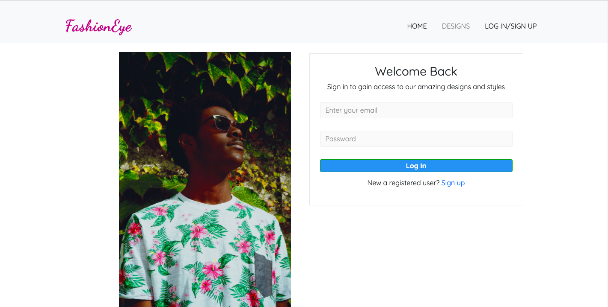

# Fashion Eye

> Fashion Eye Website is a fashion design management system where designers sign up and upload designs and view uploaded designs by other members and basically manage creating, updating and deleting designs.



## Built With

- HTML
- CSS
- Bootstrap 4
- JQuery


## Live Demo
[Fashion Eye Website](https://rawcdn.githack.com/Maryjanee/Fashion-Eye-Website/a05c05680f640c77e14360c375aa6b3db00a28ca/html/index.html)


### Setup

1. Clone this repository by using the Terminal to navigate to the desired location on your computer and then enter the following line of code into the Terminal:
```
git clone git@github.com:Maryjanee/Fashion-Eye-Website.git
```
2. Run `cd Fashion-Eye-Website` to move inside the downloaded repository.
3. Run `Yarn install` seperately to download the project's dependencies.


 Author

👤 **Maryjane Akpagbue**

- Github: [Maryjanee](https://github.com/Maryjanee)
- Twitter: [Maryjane Akpagbue](https://twitter.com/alfredmaryjane)
- Linkedin: [Maryjane Akpagbue](https://www.linkedin.com/in/maryjane-akpagbue)


## Contributing

- To contribute to this project:
- Fork this repository & clone locally.
- Create an upstream remote and sync your local copy.
- Create a new branch.
- Push your code to your origin repository.
- Create a new Pull Request .


## Show your support

Give a ⭐️ if you like this project!

## Acknowledgments

- Decagon Institute